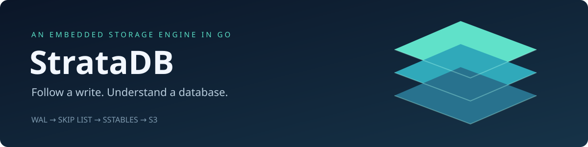
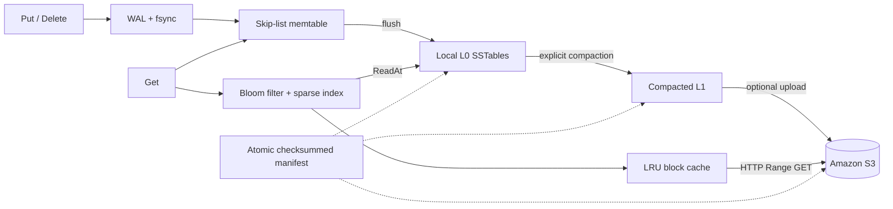
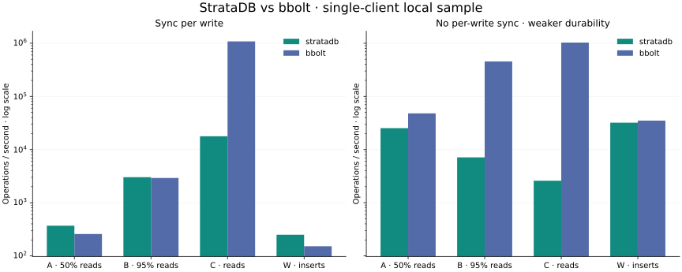

<p align="center"></p>

<p align="center">
  <a href="https://github.com/aryaMehta26/StrataDB/actions/workflows/ci.yml"></a>
  
  <a href="LICENSE"></a>
</p>

**An embedded LSM key-value engine built from first principles in Go, with crash recovery and optional S3-backed SSTables.** Trace a write through a checksummed WAL, a skip-list memtable, immutable sorted files, and remote block reads. Then inspect the tests and measurements behind each claim.

[Quick start](#run-it) · [Architecture](docs/architecture.md) · [Benchmarks](benchmarks/README.md) · [S3 guide](docs/s3.md) · [Original plan](StrataDB-PLAN.md)

## What makes it worth exploring

- **Storage internals you can read:** a skip list, framed WAL, sparse block indexes, Bloom filters, tombstones, and full-merge compaction implemented in this repository.
- **Failure behavior you can reproduce:** torn-tail recovery, corruption rejection, durable manifest publication, randomized model tests, and a subprocess SIGKILL/restart harness.
- **A real cloud read path:** AWS SDK for Go v2, immutable object uploads, HTTP Range reads, and a bounded in-memory LRU block cache.
- **Performance claims you can inspect:** single-client A/B/C/W workload mixes, sync versus no-sync, bbolt comparison, raw JSON, p50/p99 latency, and explicitly defined amplification metrics.

This is a working educational engine, not a production database. Current compaction is synchronous and merges into one L1 table; automatic multi-level compaction and cold-data policies are next steps. [Design limits and recovery assumptions →](docs/architecture.md)

## Run it

Requires Go 1.26.5+ on macOS or Linux. The local demo needs no AWS account or Docker.

```sh
git clone https://github.com/aryaMehta26/StrataDB.git
cd StrataDB
go run ./cmd/stratadb-demo
go test ./...
```

The demo writes three users, deletes one, compacts, reopens the database, and prints the two surviving records with read-path counters.

```go
package main

import (
    "fmt"
    "log"

    strata "github.com/aryaMehta26/StrataDB"
)

func main() {
    db, err := strata.Open("./data", strata.Options{}) // fsync per mutation
    if err != nil { log.Fatal(err) }
    defer db.Close()

    if err := db.Put("user:42", []byte("Ada")); err != nil { log.Fatal(err) }
    value, err := db.Get("user:42")
    if err != nil { log.Fatal(err) }
    fmt.Println(string(value)) // Ada
}
```

Also available: `Delete`, `Scan(start, end)`, `Flush`, `Compact(remote)`, `GetContext`, and `Stats`. Scans use an inclusive start and exclusive end; an empty end is unbounded. One process owns a directory. [Add MinIO or S3 →](docs/s3.md)

## Follow the data



**A successful write:** append WAL → sync → update memtable → acknowledge. At the flush threshold, table and manifest publication complete before WAL retirement. Reads search the newest version first; a tombstone stops older data from resurfacing. Remote table bytes are uploaded before the manifest references them.

The [architecture guide](docs/architecture.md) explains each crash window, the on-disk format, and why this first version retains tombstones.

## Evidence, not adjectives

<!-- RESULTS -->
**1,000 SIGKILL/restart cycles passed with zero observed acknowledged-write loss.** [Committed transcript](benchmarks/crash-recovery.txt)

The Bloom test observed **67 false positives / 9,999 absent keys (0.67%)** with no false negatives across 10,000 inserted keys; the ideal independent-hash estimate is about 0.82%.

Local sample: [recorded machine and toolchain](benchmarks/results.environment.txt); 2,000 preload keys and 5,000 measured operations. Selected StrataDB results:

| Workload | Durability | ops/s | p99 |
|---|---|---:|---:|
| Inserts | Sync | 250 | 12.564 ms |
| Inserts | No per-write sync | 32,100 | 0.080 ms |
| Reads | Sync | 17,833 | 0.094 ms |



[All 16 configurations, bbolt comparison, amplification metrics, and raw data →](benchmarks/README.md)
<!-- /RESULTS -->

These are small local experiments, not production capacity estimates. No-sync results have weaker durability. See [benchmark methodology](docs/testing.md) for timing boundaries, counter definitions, limitations, and reproduction commands.

## Explore the code

| Start here | What to inspect |
|---|---|
| [`db.go`](db.go) | Public API, publication order, version resolution, compaction, cache |
| [`internal/memtable`](internal/memtable) | Sorted skip-list insertion, replacement, and iteration |
| [`internal/storage`](internal/storage) | Record checksums, durable replacement, Bloom filter, sparse index |
| [`tiering`](tiering) | AWS SDK adapter, deadlines, exact range validation |
| [`db_test.go`](db_test.go) | Model-based verification, corruption and failure tests, crash harness |
| [`cmd/stratadb-bench`](cmd/stratadb-bench) | Workload driver and bbolt baseline |
| [`.github/workflows/ci.yml`](.github/workflows/ci.yml) | Linux/macOS race checks, vet, fuzz smoke test, 1,000-cycle crash job |

## Engineering decisions and next steps

| Decision today | Why | Next step |
|---|---|---|
| One mutex and synchronous maintenance | Easy-to-audit ordering | Immutable memtables and background flush |
| Full merge into one L1 table | Establish a correct compaction baseline | Streaming, overlap-aware leveled compaction |
| Metadata in a checksummed manifest | Simple format and publication model | Versioned SSTable footer metadata |
| JSON record payloads | Inspectable implementation | Binary encoding and compression experiments |
| Explicit S3 tiering | Keep remote publication observable | Automatic policies backed by live latency measurements |
| In-memory scans and compaction | Small implementation surface | Bounded-memory iterators |

There is no replication, SQL, transaction batching, snapshot isolation, automatic remote cleanup, or production operations layer. The [original plan](StrataDB-PLAN.md) is preserved as a roadmap; this README describes the implemented state. Live AWS/MinIO deployment and cloud latency measurements are not yet verified.

## Develop

```sh
make check      # go vet + race tests
make crash      # 1,000 SIGKILL/restart cycles
make fuzz       # 10-second record-parser fuzz smoke test
make bench      # regenerate raw benchmark samples
```

Built with AI assistance and validated with the checks documented above. Contributions should explain the invariant they preserve and include a meaningful regression test. [Contributing](CONTRIBUTING.md) · [Apache 2.0](LICENSE)
