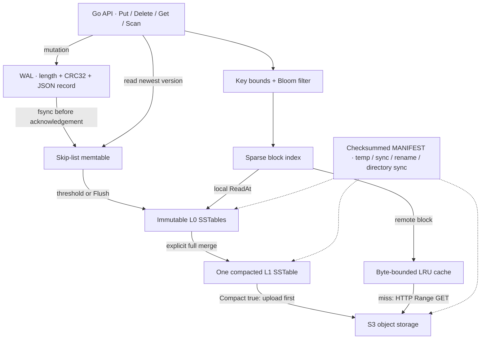

# Architecture and durability

StrataDB is a single-process embedded LSM engine for studying storage internals. A process owns a database directory with an advisory OS file lock. One mutex serializes public operations. This gives simple, auditable ordering and makes current read concurrency, maintenance pauses, and remote latency explicit limitations.

## Write and recovery protocol

1. Copy the caller's value, encode a framed record, and append it to `WAL`.
2. In default mode, call `File.Sync()` before applying the mutation to the memtable and returning success. `NoSync` skips the per-write synchronization and has weaker crash guarantees.
3. At the configured logical key/value-byte memtable threshold (not a hard RAM limit), write a unique SSTable through a temporary file, sync its contents, rename it, and sync the directory.
4. Publish a new checksummed manifest with the same durable replacement protocol. Only published tables participate in reads.
5. Truncate, seek, and sync the WAL, then replace the memtable. All operations remain serialized throughout.

| Crash point | Recovery behavior |
|---|---|
| Before complete WAL append | Incomplete trailing frame is truncated |
| After WAL sync, before table publication | Replay WAL into the memtable |
| After SSTable creation, before manifest publication | Ignore orphan table; replay WAL |
| After manifest publication, before WAL retirement | Replay may duplicate already-published versions; latest WAL entries have the same logical result |
| After WAL retirement | Published SSTables contain the checkpointed state |
| During remote upload | Previous manifest remains authoritative |

A complete record with a bad CRC fails open; it is never silently discarded. Incomplete trailing framing is treated as a torn append. A corrupted length field that resembles an incomplete tail cannot be distinguished from a torn tail in this format. Recovery is designed for interrupted writes, not arbitrary adversarial corruption. The manifest checksum detects accidental metadata damage, including Bloom bits and index offsets. SSTable records are checked when read.

I/O failure during a write or checkpoint poisons the handle: subsequent operations return that error until the database is closed and reopened. This avoids extending an uncertain WAL/manifest state. Failed remote uploads leave the current state readable. Unpublished files and uploaded objects can remain after failures.

`File.Sync` and directory-sync semantics depend on the filesystem and device. SIGKILL tests exercise process crashes, not power loss, controller caches, filesystem corruption, or every possible instruction boundary. No power-failure guarantee is inferred from the harness.

## File format, version 1

- **WAL and SSTable record:** 4-byte little-endian payload length, 4-byte CRC32 of payload, JSON payload `{Key, Value, Deleted}`. Byte values use JSON's base64 encoding. Maximum encoded payload: 64 MiB.
- **SSTable:** sorted records grouped into roughly 4 KiB blocks. A record never spans blocks; large values produce larger blocks. The manifest holds each block's first key, byte offset, and length.
- **Bloom filter:** approximately 10 bits/key and seven double-hash probes, including tombstones. Bounds are checked first. Filters can return false positives but must never return false negatives for inserted keys.
- **Manifest:** versioned JSON envelope with CRC32 over the table-list payload. Stores unique table IDs, locality, level, range, Bloom bits, size, count, and sparse indexes. The current implementation keeps metadata here rather than in SSTable footers.

The format prioritizes inspection over compression or minimal serialization overhead. It is experimental; no forward migration contract is promised.

## Reads, versions, and deletion

Reads check the memtable, then tables in newest-publication order. A tombstone stops the search. For a possible table hit, binary search selects a single data block. Remote tables use the same offsets in an S3 Range request. Successful remote blocks are validated before entering a byte-bounded LRU cache. The cache is in memory; it is not persisted across reopen.

`Scan(start, end)` merges all records and returns a materialized, sorted snapshot for the half-open interval. It is correct but not a streaming or memory-bounded iterator. Empty end means unbounded. Keys must be valid UTF-8 strings; empty keys and arbitrary byte values are supported. Returned values do not alias the memtable.

## Compaction and tiering tradeoffs

`Compact(false)` merges the entire live table set and memtable into one L1 table. `Compact(true)` publishes that output in the object store. Both are explicit and block all operations. New flushes create local L0 tables above the compacted table. Tombstones are retained so WAL replay before retirement cannot resurrect a deleted key. This is a full-merge baseline, **not automatic multi-level leveled compaction**.

Compaction materializes the keyspace and output file in memory. It does not yet scale beyond datasets that comfortably fit RAM. Local obsolete files are deleted after the manifest commits; failed cleanup and remote obsolete objects require manual offline garbage collection. There is no background worker, automatic coldness policy, multipart upload, or remote GC. Uploads use one PutObject request. Remote requests have a 30-second deadline; `GetContext` also accepts an earlier caller deadline. A slow uncached remote request holds the database mutex.

## Next design steps

1. Immutable memtable rotation plus separate WAL generations, allowing writes during flush.
2. Streaming merge iterators and bounded-memory SSTable writers.
3. Non-overlapping higher levels, size thresholds, and overlap-aware compaction.
4. Versioned read views and a manifest lifecycle that safely reclaims tombstones and objects.
5. Automatic tiering with measured live S3 latency and cost; persistable block cache.

Each step changes recovery invariants and must extend the failure tests before performance claims change.
